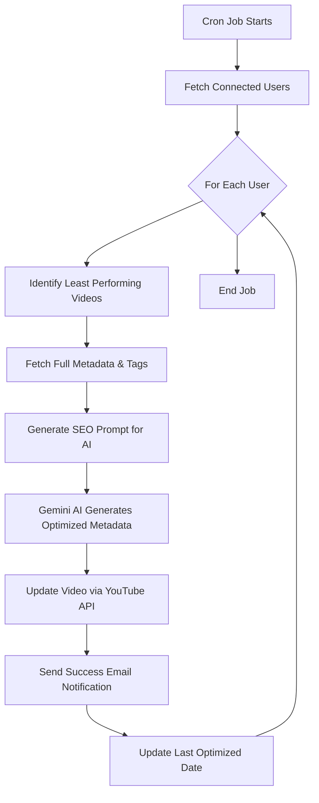

# SEOTube — Automatic YouTube SEO Assistant

SEOTube is a powerful developer tool designed to help YouTube creators revitalize underperforming content. By combining **YouTube Analytics**, **Google Gemini AI**, and **Automated Cron Jobs**, SEOTube identifies videos that aren't reaching their potential and automatically updates their metadata to improve search visibility and Click-Through Rate (CTR).

---

## 📑 Table of Contents
- [🚀 Overview](#-overview)
- [✨ Key Features](#-key-features)
- [🛠️ Tech Stack](#️-tech-stack)
- [📊 SEOTube vs YouTube Studio](#-seotube-vs-youtube-studio)
- [🏗️ Architecture & Workflow](#️-architecture--workflow)
- [⚙️ Environment Variables](#️-environment-variables)
- [🚀 Setup & Installation](#-setup--installation)
- [🔒 Security & Privacy](#-security--privacy)

---

## 🚀 Overview
SEOTube acts as an automated SEO strategist for your channel. Instead of manually reviewing hundreds of videos, SEOTube's background engine finds your "least performing" content and applies data-driven metadata improvements while you sleep.

---

## ✨ Key Features
- **🤖 Automatic SEO Optimization**: Scheduled cron jobs detect low-performance videos and update titles, descriptions, tags, and categories using AI.
- **⚡ On-Demand Optimization**: Manually trigger an SEO overhaul for any specific video directly from the dashboard.
- **💡 AI Growth Insights**: Receive tailored channel advice and 5 high-potential video ideas based on your recent upload patterns.
- **📅 Consistency Tracking**: Interactive graph showing upload gaps and a health meter for your posting schedule.
- **📧 Smart Notifications**: Get summarized email reports after every optimization run and reminders when you've been inactive for too long.
- **🛑 Pause Control**: Instantly toggle automated updates on or off from your user profile.
- **🔐 Enterprise-Grade Security**: AES-256-GCM encryption for OAuth tokens and JWT-based session management.

---

## 🛠️ Tech Stack
- **Frontend**: Vite + React, CSS3 (Glassmorphism & Micro-animations)
- **Backend**: Node.js, Express, TypeScript
- **Database**: MongoDB (Mongoose)
- **AI Engine**: Google Gemini (Primary) / OpenAI (Optional)
- **Email**: Resend API
- **Scheduling**: Node-cron
- **YouTube Integration**: YouTube Data API v3, YouTube Analytics API

---

## 📊 SEOTube vs YouTube Studio

| Feature | SEOTube | YouTube Studio |
| :--- | :---: | :---: |
| **Automated Metadata Updates** | ✔️ | ❌ |
| **AI-Powered Title/Hooks** | ✔️ | ❌ |
| **Scheduled SEO Cron Jobs** | ✔️ | ❌ |
| **Upload Consistency Reminders** | ✔️ | ❌ |
| **Bulk Performance Analysis** | ✔️ | ✔️ |
| **AI Video Idea Generation** | ✔️ | ❌ |
| **Automatic Hashtag Injection** | ✔️ | ❌ |

---

## 🏗️ Architecture & Workflow

### Optimization Cron Job Flow


### Repository Layout
- `backend/` — Express server, cron jobs, and AI integration.
- `frontend/` — React application with performance dashboards.

---

## ⚙️ Environment Variables

### Backend (`backend/.env`)
| Variable | Description | Default |
| :--- | :--- | :--- |
| `PORT` | Server listening port | `3000` |
| `MONGO_URI` | MongoDB Connection String | - |
| `YT_CLIENT_ID` | Google Cloud OAuth Client ID | - |
| `YT_CLIENT_SECRET` | Google Cloud OAuth Client Secret | - |
| `GEMINI_API_KEY` | Google Gemini AI Key | - |
| `GEMINI_MODEL` | AI Model Version | `gemini-2.5-flash-lite` |
| `JWT_SECRET` | Secret for user sessions | - |
| `REFRESH_TOKEN_SECRET` | Secret for token encryption | - |
| `RESEND_API_KEY` | Resend Email API Key | - |
| `FRONTEND_BASE` | URL of the frontend app | - |
| `BACKEND_BASE` | URL of the backend API | `http://localhost:3000` |
| `CRON_TIME` | SEO Cron Schedule (Cron Expr) | `0 0 */15 * *` |
| `CRON_TIME2` | Reminder Cron Schedule | `0 0 */1 * *` |
| `DESCRIPTION_CHARACTERS_COUNT` | Max AI Description Length | `1500` |

### Frontend (`frontend/.env`)
- `BACKEND_BASE` — Backend API base URL (e.g., `http://localhost:3000`)

---

## 🚀 Setup & Installation

### Prerequisites
- Node.js (v18+)
- MongoDB Atlas or local instance
- Google Cloud Project with YouTube APIs enabled

### 1. Clone & Install
```bash
git clone https://github.com/your-repo/seotube.git
cd seotube
```

### 2. Backend Setup
```bash
cd backend
npm install
cp .example.env .env
# Edit .env with your credentials
npm run dev
```

### 3. Frontend Setup
```bash
cd frontend
npm install
cp .example.env.com .env
# Set BACKEND_BASE=http://localhost:3000
npm run dev
```

---

## 🔒 Security & Privacy
- **Encrypted Tokens**: Refresh tokens are stored using `aes-256-gcm` encryption.
- **Revokable Access**: Deleting your account automatically attempts to revoke Google OAuth permissions.
- **Secure Auth**: Passwords are hashed with `bcrypt`, and session tokens use secure cookies.

---
*Created to help YouTube creators automate metadata SEO improvements and provide actionable channel guidance.*
